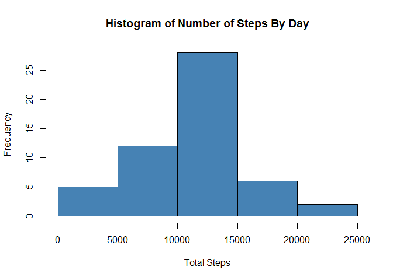
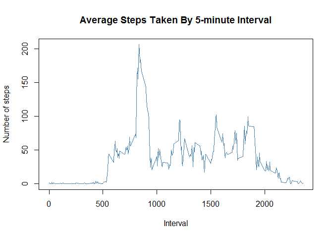
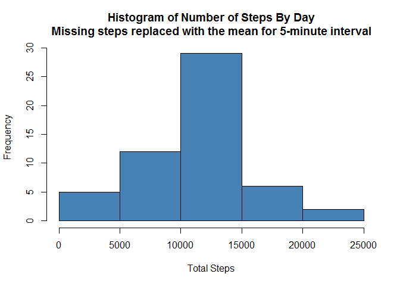

# Reproducible Research Course Project 1
Juan Rico  
20 May 2017  


## Introduction

It is now possible to collect a large amount of data about personal movement using activity monitoring devices such as a Fitbit, Nike Fuelband, or Jawbone Up. These type of devices are part of the "quantified self" movement - a group of enthusiasts who take measurements about themselves regularly to improve their health, to find patterns in their behavior, or because they are tech geeks. But these data remain under-utilized both because the raw data are hard to obtain and there is a lack of statistical methods and software for processing and interpreting the data.

This assignment makes use of data from a personal activity monitoring device. This device collects data at 5 minute intervals through out the day. The data consists of two months of data from an anonymous individual collected during the months of October and November, 2012 and include the number of steps taken in 5 minute intervals each day.

The data for this assignment can be downloaded from the course web site:

- [Activity Monitoring Data](https://d396qusza40orc.cloudfront.net/repdata%2Fdata%2Factivity.zip)

The variables included in this dataset are:

- **steps:** Number of steps taking in a 5-minute interval (missing values are coded as NA)
- **date:** The date on which the measurement was taken in YYYY-MM-DD format
- **interval:** Identifier for the 5-minute interval in which measurement was taken

The dataset is stored in a comma-separated-value (CSV) file and there are a total of 17,568 observations in this dataset.

## Loading and proprocessing

Define the libraries used, load the activity file and convert the date field to a 'Date' type


```r
library(dplyr)
library(lattice)
library(chron)

activity <- read.csv("./data/activity.csv", stringsAsFactors = FALSE)
activity <- mutate(activity, date = as.Date(date, format = "%Y-%m-%d"))

head(activity)
```

```
##   steps       date interval
## 1    NA 2012-10-01        0
## 2    NA 2012-10-01        5
## 3    NA 2012-10-01       10
## 4    NA 2012-10-01       15
## 5    NA 2012-10-01       20
## 6    NA 2012-10-01       25
```

## What is mean total number of steps taken per day?

For this part of the assignment, you can ignore the missing values in the dataset.

1. Calculate the total number of steps taken per day


```r
activityByDate <-
    activity %>%
    na.omit() %>%
    group_by(date) %>%
    summarise(totalSteps = sum(steps))

head(activityByDate)
```

```
## # A tibble: 6 x 2
##         date totalSteps
##       <date>      <int>
## 1 2012-10-02        126
## 2 2012-10-03      11352
## 3 2012-10-04      12116
## 4 2012-10-05      13294
## 5 2012-10-06      15420
## 6 2012-10-07      11015
```

2. If you do not understand the difference between a histogram and a barplot, research the difference between them. Make a histogram of the total number of steps taken each day


```r
hist(activityByDate$totalSteps,
     xlab = "Total Steps",
     main = "Histogram of Number of Steps By Day",
     col = "steelblue")
```

<!-- -->

Calculate and report the mean and median of the total number of steps taken per day

**Mean:**

```r
meanSteps <- mean(activityByDate$totalSteps)
meanSteps
```

```
## [1] 10766.19
```

**Median:**

```r
medianSteps <- median(activityByDate$totalSteps)
medianSteps
```

```
## [1] 10765
```

## What is the average daily activity pattern?

1. Make a time series plot (i.e. type = "l") of the 5-minute interval (x-axis) and the average number of steps taken, averaged across all days (y-axis)


```r
activityByInterval <-
    activity %>%
    na.omit() %>%
    group_by(interval) %>%
    summarise(meanSteps = mean(steps))

head(activityByInterval)
```

```
## # A tibble: 6 x 2
##   interval meanSteps
##      <int>     <dbl>
## 1        0 1.7169811
## 2        5 0.3396226
## 3       10 0.1320755
## 4       15 0.1509434
## 5       20 0.0754717
## 6       25 2.0943396
```

```r
with(activityByInterval,
    plot( interval,
          meanSteps,
          type = "l",
          ylab = "Number of steps",
          xlab = "Interval",
          main = "Average Steps Taken By 5-minute Interval",
          col = "steelblue"
          )
     )
```

<!-- -->

2. Which 5-minute interval, on average across all the days in the dataset, contains the maximum number of steps?


```r
interval <- filter(activityByInterval, meanSteps == max(meanSteps)) %>% select(interval)
interval
```

```
## # A tibble: 1 x 1
##   interval
##      <int>
## 1      835
```

## Imputing missing values

Note that there are a number of days/intervals where there are missing values (coded as NA). The presence of missing days may introduce bias into some calculations or summaries of the data.

1. Calculate and report the total number of missing values in the dataset (i.e. the total number of rows with NAs)


```r
sum(is.na(activity))
```

```
## [1] 2304
```

2. Devise a strategy for filling in all of the missing values in the dataset. The strategy does not need to be sophisticated. For example, you could use the mean/median for that day, or the mean for that 5-minute interval, etc.

Strategy chosen is to replace missing values with the mean for that 5-minute interval

3. Create a new dataset that is equal to the original dataset but with the missing data filled in.
Make a histogram of the total number of steps taken each day and Calculate and report the mean and median total number of steps taken per day.


```r
missingActivities <- which(is.na(activity) == TRUE) 
head(missingActivities)
```

```
## [1] 1 2 3 4 5 6
```

Replace the missing steps (NA's) with the average steps from the interval summary  
Activity col 1 = steps, col 3 = interval, activity by interval col 2 = steps

```r
adjActivity <- activity
adjActivity[missingActivities, 1] <-
    activityByInterval[activityByInterval$interval == activity[missingActivities, 3], 2]
head(adjActivity)
```

```
##       steps       date interval
## 1 1.7169811 2012-10-01        0
## 2 0.3396226 2012-10-01        5
## 3 0.1320755 2012-10-01       10
## 4 0.1509434 2012-10-01       15
## 5 0.0754717 2012-10-01       20
## 6 2.0943396 2012-10-01       25
```

```r
adjActivityByDate <-
    adjActivity %>%
    na.omit() %>%
    group_by(date) %>%
    summarise(totalSteps = sum(steps))
head(adjActivityByDate)
```

```
## # A tibble: 6 x 2
##         date totalSteps
##       <date>      <dbl>
## 1 2012-10-01   10766.19
## 2 2012-10-02     126.00
## 3 2012-10-03   11352.00
## 4 2012-10-04   12116.00
## 5 2012-10-05   13294.00
## 6 2012-10-06   15420.00
```

```r
hist(adjActivityByDate$totalSteps,
     xlab = "Total Steps",
     main = "Histogram of Number of Steps By Day\nMissing steps replaced with the mean for 5-minute interval",
     col = "steelblue")
```

<!-- -->

Do these values differ from the estimates from the first part of the assignment?

**Adjusted Mean:**

```r
adjMeanSteps <- mean(adjActivityByDate$totalSteps)
adjMeanSteps
```

```
## [1] 10766.19
```

**Adjusted Median:**

```r
adjMedianSteps <- median(adjActivityByDate$totalSteps)
adjMedianSteps
```

```
## [1] 10765.59
```

**Diference to orginal mean and median respectively:**

```r
meanSteps - adjMeanSteps
```

```
## [1] 0
```

```r
medianSteps - adjMedianSteps
```

```
## [1] -0.5943396
```

What is the impact of imputing missing data on the estimates of the total daily number of steps?

Given the strategy was to replace missing values with the mean for that 5-minute interval there is very little differnce between the two. The greatest impact can be seen in the histogram with a slight increase in the frequenct beteen 10-15000 steps.  However, the mean is the same as the original calculation and median is only slighly higher.

## Are there differences in activity patterns between weekdays and weekends?

For this part the weekdays() function may be of some help here. Use the dataset with the filled-in missing values for this part.

1. Create a new factor variable in the dataset with two levels - "weekday" and "weekend" indicating whether a given date is a weekday or weekend day.


```r
adjActivity$dayType <- as.factor(ifelse(is.weekend(adjActivity$date), 'weekend', 'weekday'))

head(activity)
```

```
##   steps       date interval
## 1    NA 2012-10-01        0
## 2    NA 2012-10-01        5
## 3    NA 2012-10-01       10
## 4    NA 2012-10-01       15
## 5    NA 2012-10-01       20
## 6    NA 2012-10-01       25
```

```r
activityByDayTypeAndInterval <-
    adjActivity %>%
    na.omit() %>%
    group_by(dayType, interval) %>%
    summarise(meanSteps = mean(steps))

head(activityByDayTypeAndInterval)
```

```
## Source: local data frame [6 x 3]
## Groups: dayType [1]
## 
## # A tibble: 6 x 3
##   dayType interval meanSteps
##    <fctr>    <int>     <dbl>
## 1 weekday        0 2.3179245
## 2 weekday        5 0.4584906
## 3 weekday       10 0.1783019
## 4 weekday       15 0.2037736
## 5 weekday       20 0.1018868
## 6 weekday       25 1.5273585
```

2. Make a panel plot containing a time series plot (i.e. type = "l") of the 5-minute interval (x-axis) and the average number of steps taken, averaged across all weekday days or weekend days (y-axis). See the README file in the GitHub repository to see an example of what this plot should look like using simulated data.


```r
xyplot(meanSteps ~ interval | dayType,
       data=activityByDayTypeAndInterval,
       layout=c(1, 2),
       type ="l",
       ylab = "Number of Steps",
       xlab = "Interval")
```

<!-- -->
